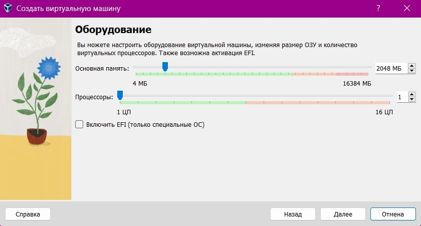
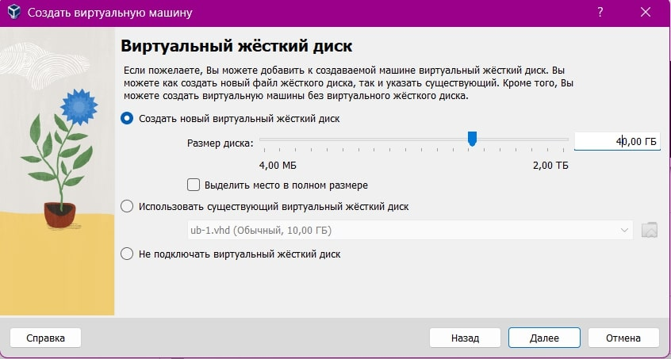
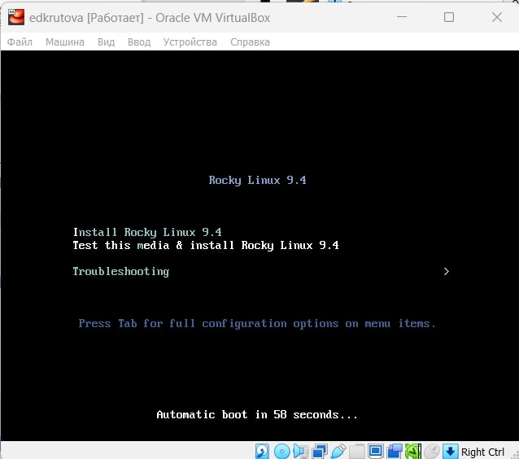
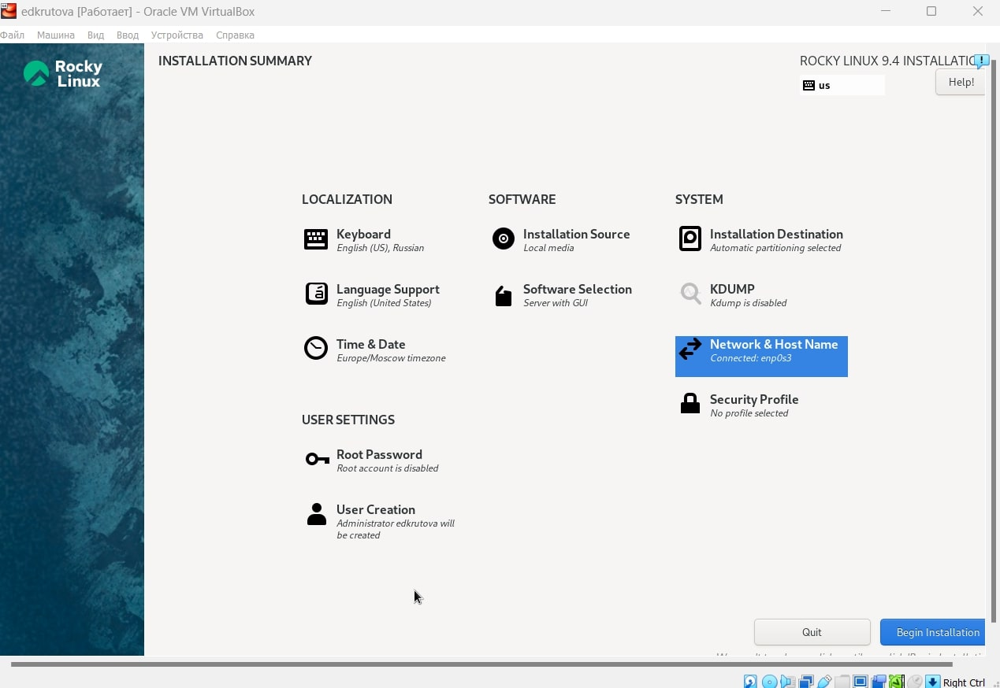
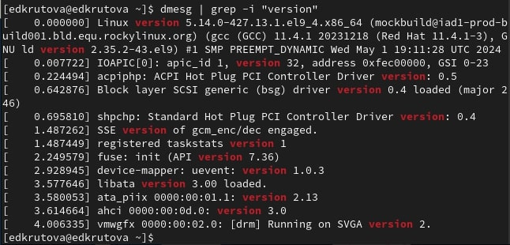
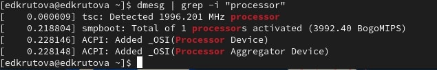
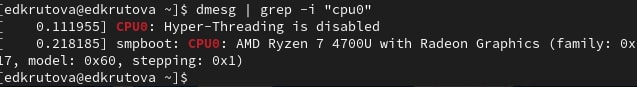

---
## Front matter
lang: ru-RU
title: Лабораторная работа №1
subtitle: Установка и конфигурация операционной системы на виртуальную машину
author:
  - Крутова Е. Д.
institute:
  - Российский университет дружбы народов, Москва, Россия
date: 07 сентября 2024

## i18n babel
babel-lang: russian
babel-otherlangs: english

## Formatting pdf
toc: false
toc-title: Содержание
slide_level: 2
aspectratio: 43
section-titles: true
theme: metropolis
header-includes: 
 - \metroset{progressbar=frametitle,sectionpage=progressbar,numbering=fraction}
 - '\makeatletter'
 - '\beamer@ignorenonframefalse'
 - '\makeatother'
aspectratio: 43
section-titles: true
---

# Информация

## Докладчик

:::::::::::::: {.columns align=center}
::: {.column width="70%"}

* Крутова Екатерина Дмитриевна
* студентка группы НПИбд-01-21
* Российский университет дружбы народов
* [1032216536@pfur.ru](mailto:1032216536@pfur.ru)
* <https://edkrutova.github.io/ru/>

:::
::: {.column width="30%"}

:::
::::::::::::::

# Цель работы

Целью данной работы является приобретение практических навыков
установки операционной системы на виртуальную машину, настройки минимально необходимых для дальнейшей работы сервисов.

# Выполнение работы

## Создание виртуальной машины

{#fig:001 width=30%}

{#fig:002 width=30%}

{#fig:003 width=30%}

## Запуск машины

{#fig:004 width=70%}

## Настройки установки операционной системы

{#fig:005 width=70%}

## Выполнение заданий

{#fig:006 width=30%}

{#fig:007 width=30%}

{#fig:008 width=30%}

# Выводы

Я приобрела практические навыки установки операционной системы на виртуальную машину, настройки минимально необходимых для дальнейшей работы сервисов.

# Контрольные вопросы

1. Какую информацию содержит учётная запись пользователя?

Учётная запись пользователя в Linux содержит следующую информацию:

* Имя пользователя,
* Пароль,
* UID (User ID),
* GID (Group ID),
* Домашний каталог,
* Оболочка (Shell),
* Информация о пользователе.

2. Как удалить зависший процесс?

kill PID
