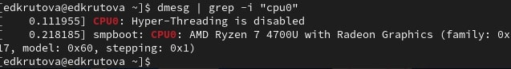

---
## Front matter
title: "Лабораторная работа №1"
subtitle: "Установка и конфигурация операционной системы на виртуальную машину"
author: "Крутова Екатерина Дмитриевна"

## Generic otions
lang: ru-RU
toc-title: "Содержание"

## Bibliography
bibliography: bib/cite.bib
csl: pandoc/csl/gost-r-7-0-5-2008-numeric.csl

## Pdf output format
toc: true # Table of contents
toc-depth: 2
lof: true # List of figures
lot: true # List of tables
fontsize: 12pt
linestretch: 1.5
papersize: a4
documentclass: scrreprt
## I18n polyglossia
polyglossia-lang:
  name: russian
  options:
	- spelling=modern
	- babelshorthands=true
polyglossia-otherlangs:
  name: english
## I18n babel
babel-lang: russian
babel-otherlangs: english
## Fonts
mainfont: PT Serif
romanfont: PT Serif
sansfont: PT Sans
monofont: PT Mono
mainfontoptions: Ligatures=TeX
romanfontoptions: Ligatures=TeX
sansfontoptions: Ligatures=TeX,Scale=MatchLowercase
monofontoptions: Scale=MatchLowercase,Scale=0.9
## Biblatex
biblatex: true
biblio-style: "gost-numeric"
biblatexoptions:
  - parentracker=true
  - backend=biber
  - hyperref=auto
  - language=auto
  - autolang=other*
  - citestyle=gost-numeric
## Pandoc-crossref LaTeX customization
figureTitle: "Рис."
tableTitle: "Таблица"
listingTitle: "Листинг"
lofTitle: "Список иллюстраций"
lotTitle: "Список таблиц"
lolTitle: "Листинги"
## Misc options
indent: true
header-includes:
  - \usepackage{indentfirst}
  - \usepackage{float} # keep figures where there are in the text
  - \floatplacement{figure}{H} # keep figures where there are in the text
---

# Цель работы

Целью данной работы является приобретение практических навыков
установки операционной системы на виртуальную машину, настройки минимально необходимых для дальнейшей работы сервисов.

# Задание

1. Установить операционную систему на виртуальную машину

2. Получите следующую информацию:

1) Версия ядра Linux (Linux version).

2) Частота процессора (Detected Mhz processor).

3) Модель процессора (CPU0).

4) Объем доступной оперативной памяти (Memory available).

5) Тип обнаруженного гипервизора (Hypervisor detected).

6) Тип файловой системы корневого раздела.

7) Последовательность монтирования файловых систем.

# Выполнение лабораторной работы

1. Установка операционной системы на виртуальную машину (рис. [-@fig:001] - [-@fig:007]).

{#fig:001 width=70%}

{#fig:002 width=70%}

{#fig:003 width=70%}

{#fig:004 width=70%}

{#fig:005 width=70%}

{#fig:006 width=70%}

{#fig:007 width=70%}

2. Получение информации ([-@fig:008] - [-@fig:013])

{#fig:008 width=70%}

{#fig:009 width=70%}

{#fig:010 width=70%}

{#fig:011 width=70%}

{#fig:012 width=70%}

{#fig:013 width=70%}

# Выводы

Я приобрела практические навыки установки операционной системы на виртуальную машину, настройки минимально необходимых для дальнейшей работы сервисов.

# Контрольные вопросы

1. Какую информацию содержит учётная запись пользователя?

Учётная запись пользователя в Linux содержит следующую информацию:

- Имя пользователя,
- Пароль,
- UID (User ID),
- GID (Group ID),
- Домашний каталог,
- Оболочка (Shell),
- Информация о пользователе.

2. Укажите команды терминала и приведите примеры (рис. [-@fig:014] - [-@fig:018]):

– для получения справки по команде:
man <команда>

{#fig:014 width=70%}

– для перемещения по файловой системе:
cd <директория>

{#fig:015 width=70%}

– для просмотра содержимого каталога:
ls (<директория>)

{#fig:016 width=70%}

– для определения объёма каталога:
du

{#fig:017 width=70%}

– для создания / удаления каталогов / файлов:
mkdir для создания и rm для удаления

{#fig:018 width=70%}

– для задания определённых прав на файл / каталог:
chmod

– для просмотра истории команд:
history

3. Что такое файловая система? Приведите примеры с краткой характеристикой.
Файловая система — это способ организации хранения файлов на носителе (диске, флешке и т. д.).

Примеры распространённых файловых систем:

FAT32 — одна из самых старых файловых систем для персональных компьютеров, предназначалась для гибких дисков.

NTFS — более новая технология, которая создавалась специально для устранения недостатков, присущих FAT32. Построена как бинарное дерево, доступ к файлам открывается по запросу, а искать их можно прямо по названию.

4. Как посмотреть, какие файловые системы подмонтированы в ОС?
cat /proc/mounts

5. Как удалить зависший процесс?

kill PID

# Список литературы
