---
## Front matter
lang: ru-RU
title: Лабораторная работа №3
subtitle: Дискреционное разграничение прав в Linux. Два пользователя
author:
  - Крутова Е. Д.
institute:
  - Российский университет дружбы народов, Москва, Россия
date: 07 сентября 2024

babel-lang: russian
babel-otherlangs: english
mainfont: Arial
monofont: Courier New
fontsize: 10pt

## Formatting pdf
toc: false
toc-title: Содержание
slide_level: 2
aspectratio: 169
section-titles: true
theme: metropolis
header-includes:
 - \metroset{progressbar=frametitle,sectionpage=progressbar,numbering=fraction}
 - '\makeatletter'
 - '\beamer@ignorenonframefalse'
 - '\makeatother'
---

# Информация

## Докладчик

:::::::::::::: {.columns align=center}
::: {.column width="70%"}

* Крутова Екатерина Дмитриевна
* студентка группы НПИбд-01-21
* Российский университет дружбы народов
* [1032216536@pfur.ru](mailto:1032216536@pfur.ru)
* <https://edkrutova.github.io/ru/>

:::
::: {.column width="30%"}

:::
::::::::::::::

# Цель работы

Целью данной работы является приобретение практических навыков работы в консоли с атрибутами файлов для групп пользователей.

# Выполнение работы 1

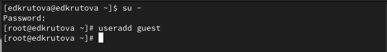{#fig:001 width=40%}

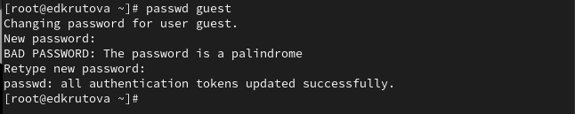{#fig:002 width=40%}

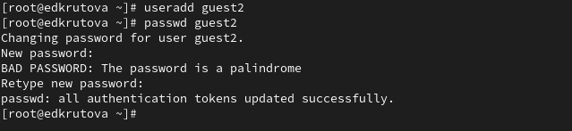{#fig:003 width=40%}

# Выполнение работы 2

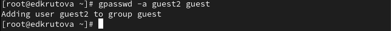{#fig:004 width=40%}

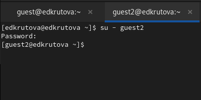{#fig:005 width=40%}

# Выполнение работы 3

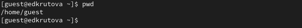{#fig:006 width=40%}

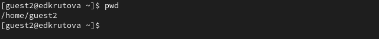{#fig:007 width=40%}

# Выполнение работы 4

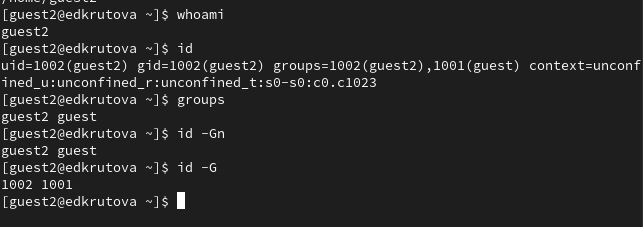{#fig:008 width=50%}

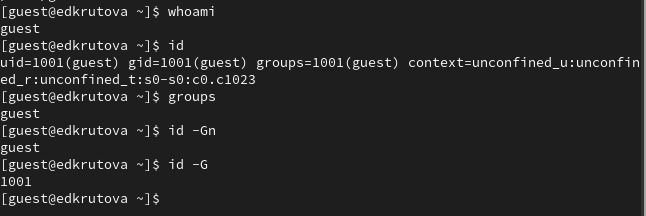{#fig:009 width=50%}

# Выполнение работы 5

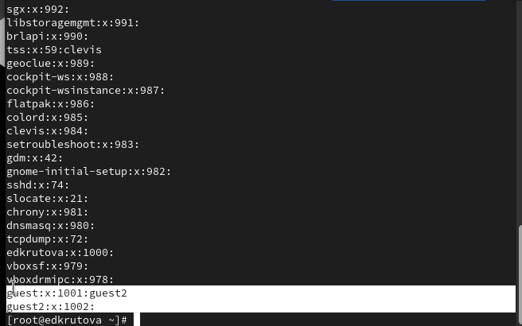{#fig:010 width=70%}

# Выполнение работы 6

{#fig:011 width=70%}

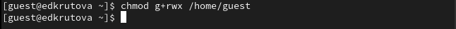{#fig:012 width=70%}

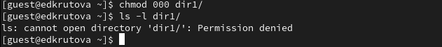{#fig:013 width=70%}

# Заполнение таблицы

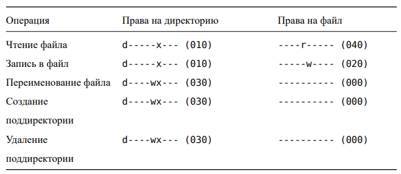{#fig:014 width=70%}

# Выводы

Я приобрела практические навыки работы в консоли с атрибутами файлов для групп пользователей.