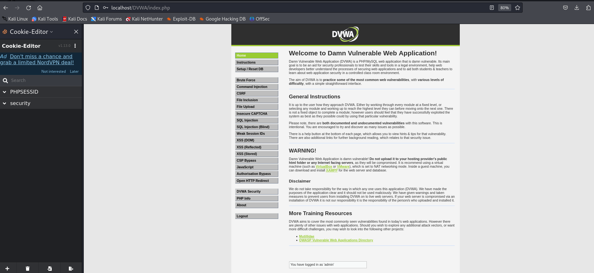
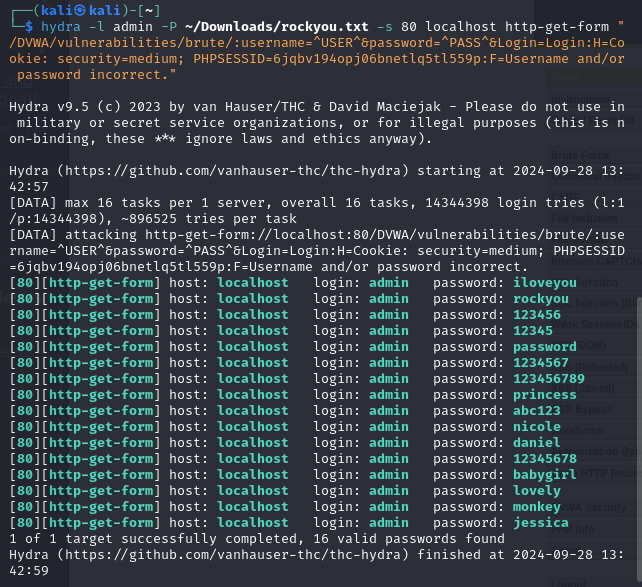
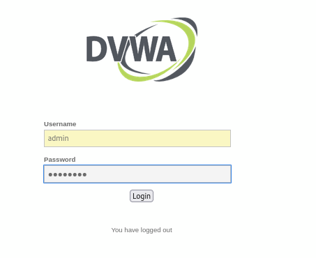

---
## Front matter
lang: ru-RU
title: Индивидуальный проект
subtitle: Этап 3. Работа с Hydra
author:
  - Крутова Е. Д.
institute:
  - Российский университет дружбы народов, Москва, Россия
date: 07 сентября 2024

babel-lang: russian
babel-otherlangs: english
mainfont: Arial
monofont: Courier New
fontsize: 10pt

## Formatting pdf
toc: false
toc-title: Содержание
slide_level: 2
aspectratio: 169
section-titles: true
theme: metropolis
header-includes:
 - \metroset{progressbar=frametitle,sectionpage=progressbar,numbering=fraction}
 - '\makeatletter'
 - '\beamer@ignorenonframefalse'
 - '\makeatother'
---

# Информация

## Докладчик

:::::::::::::: {.columns align=center}
::: {.column width="70%"}

* Крутова Екатерина Дмитриевна
* студентка группы НПИбд-01-21
* Российский университет дружбы народов
* [1032216536@pfur.ru](mailto:1032216536@pfur.ru)
* <https://edkrutova.github.io/ru/>

:::
::: {.column width="30%"}

:::
::::::::::::::

# Цель работы

Целью данной работы является использование Hydra для получения паролей.

# Шаг 1

{#fig:001 width=70%}

# Шаг 2

{#fig:002 width=70%}

Это GET-запрос с двумя параметрами cookie: безопасность и PHPSESSID, найденными с помощью расширения.

# Шаг 3

{#fig:003 width=70%}

# Выводы

Я установила успешно получила пароль с помощью Hydra и файлов cookies.
